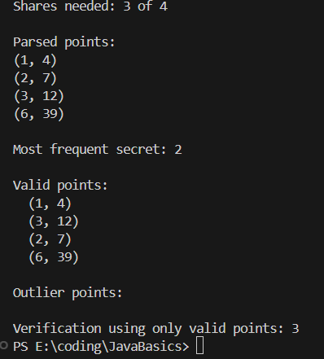

output 1:
 

output 2:

 

This Java program produces a reconstruction of a secret using Shamir’s Secret Sharing approach, based on a JSON file with secret shares. The program defines a basic Point class, so you can represent a share as an (x,y) pair, with y a BigInteger.
To begin, we read the json file and now we have the total number of shares (n), and the number of shares needed to reconstruct the secret (k). Then we take all of the shares and parse them as Points, and use a combination method to produce all possible combinations of k shares. Each combination use Lagrange interpolation to determine the secret at x=0, and count the frequency of each secret investigated. The most frequent value will be the true secret. After we identify the true secret we can identify those that are associative shares, which will return to the true secret, and those that are outliers. Finally, we can demonstrate and verify, the reconstruction of the secret using only our associative shares. Some helper methods take care of the tasks for us, for extracting the integers from the json, parsing points, producing combinations as well as, performing the Lagrange interpolation. So to sum it all together, the program reads the shares, arrives at some possible secrets, incoherently identifies associative and associative points, and verifies the secret reconstruction.
